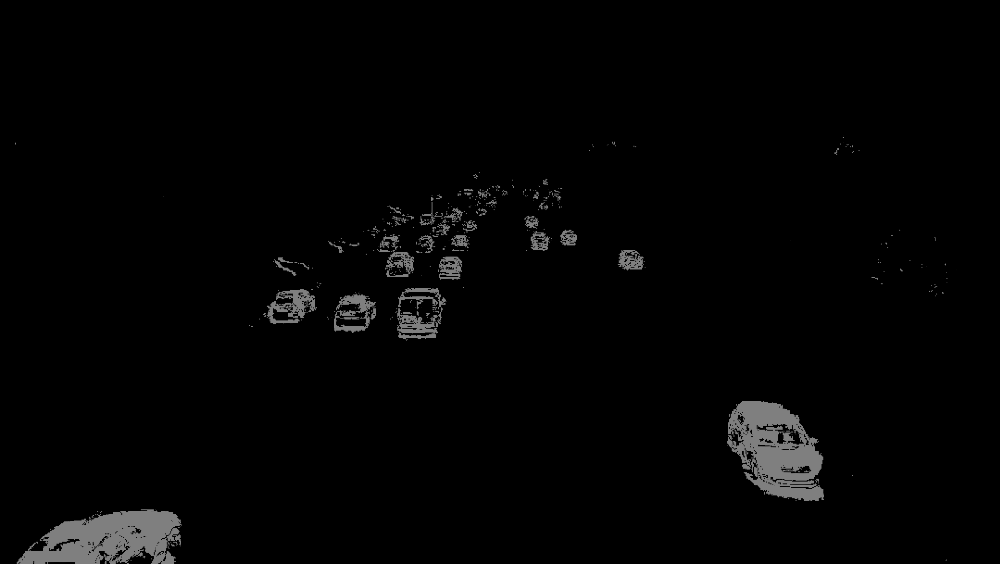
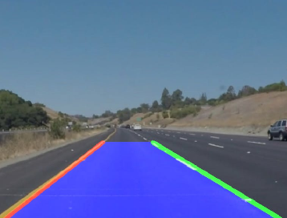
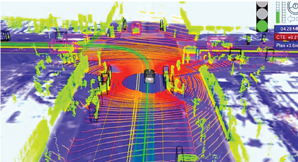

# 🚘 Autonomix VisionCraft – AI-Powered Object Detection & Navigation

**Autonomix VisionCraft** is an AI-powered vision system designed to detect and interpret real-world road elements such as vehicles, pedestrians, lanes, and traffic signs. It simulates foundational aspects of autonomous navigation using computer vision and deep learning — aimed at building the core of an intelligent driving assistant (not quite Tesla-level... yet 😉).

---

## 🎯 Features

- 🚗 Real-time detection of cars, pedestrians, signals, and road signs
- 🛣️ Lane detection using edge and perspective transforms
- 🎥 Live video feed processing or webcam integration
- 🧠 Deep learning-based object recognition using YOLO / SSD
- 🗺️ Path prediction logic (basic navigation intent)
- 🧪 Offline testing on recorded dashcam datasets or videos

---

## 🧠 Tech Stack

- **Languages:** Python
- **Libraries:** OpenCV, NumPy, TensorFlow/Keras or PyTorch
- **Models:** YOLOv5 / SSD MobileNet (custom or pre-trained)
- **Optional:** Raspberry Pi / Jetson Nano (for deployment)

---

## 🖼️ Demo & Results

### 🔹 Sample Detection Frame

### 🔹 Lane Detection

### 🔹 Lidar

---

## 📸 How It Works

1. **Video Feed Input:** From webcam or video file
2. **Object Detection Model:** Identifies cars, people, bikes, etc.
3. **Lane Detection:** Uses Canny edge + Hough transform for lanes
4. **Bounding Boxes:** Draws labels and confidence scores
5. **Path Logic:** Simulates next move based on obstacle and lane layout